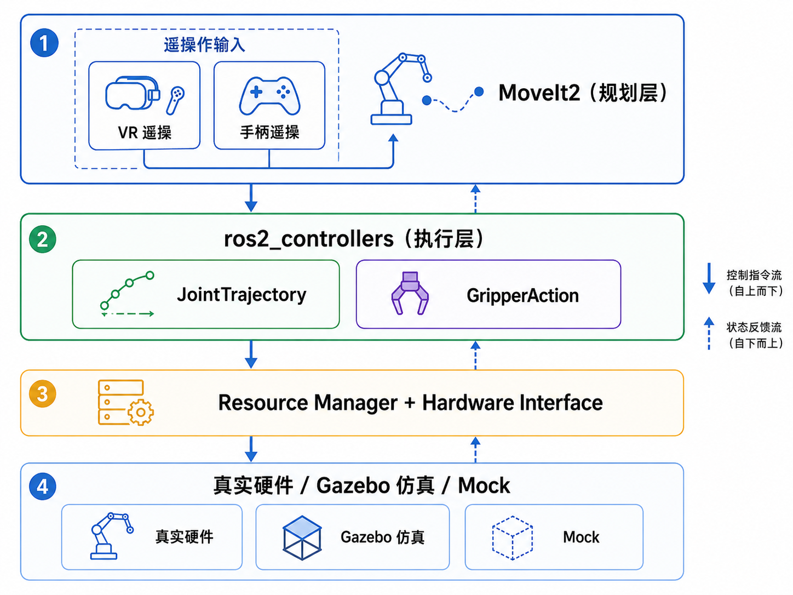

# reBot ROS2 Control

<div align="center">

[](https://docs.ros.org/en/humble/)
[](LICENSE)
[](https://github.com/Eaglewzw/rebot_ros2_control)

</div>

基于 [ROS2 Control](https://control.ros.org/master/index.html) 框架的 **reBot 机械臂** 控制项目。

## 📖 项目简介

本项目实现了 reBot 机械臂在 ROS2 环境下的运动控制，采用 `ros2_control` 框架，提供：

- **硬件接口 (Hardware Interface)**: 与真实机械臂 / 仿真环境的底层通信
- **控制器 (Controllers)**: 基于 `ros2_controllers` 的轨迹跟踪 / 关节位置 / 力控/阻抗控制
- **MoveIt2 集成**: 运动规划 + 碰撞检测 + 轨迹生成
- **Gazebo / Ignition 仿真**: 无需硬件即可开发和测试


### 框架概览

<p align="center">
  
</p>

## 🚀 快速开始


### 安装

```bash
# 创建工作空间
mkdir -p ~/rebot_ws/src && cd ~/rebot_ws/src

# 克隆仓库
git clone https://github.com/Eaglewzw/rebot_ros2_control.git

# 编译
colcon build --symlink-install
source install/setup.bash
```

### 启动

```bash
# 仿真模式 (Gazebo)
ros2 launch rebot_bringup rebot_sim.launch.py

# 真实硬件模式
ros2 launch rebot_bringup rebot_hardware.launch.py

# MoveIt2 运动规划
ros2 launch rebot_moveit_config moveit.launch.py
```

## 🎮 控制方式

```bash
# 关节位置控制
ros2 topic pub /position_commands std_msgs/msg/Float64MultiArray ...

# 轨迹控制 (MoveIt2 自动发布)
ros2 action send_goal /joint_trajectory_controller/follow_joint_trajectory ...

# 夹爪控制
ros2 action send_goal /gripper_controller/gripper_action ...
```

## 📄 License

本项目采用 [Apache 2.0](LICENSE) 许可证。

---

<p align="center">
  <b>reBot</b> — Built with ❤️ and ROS2
</p>
